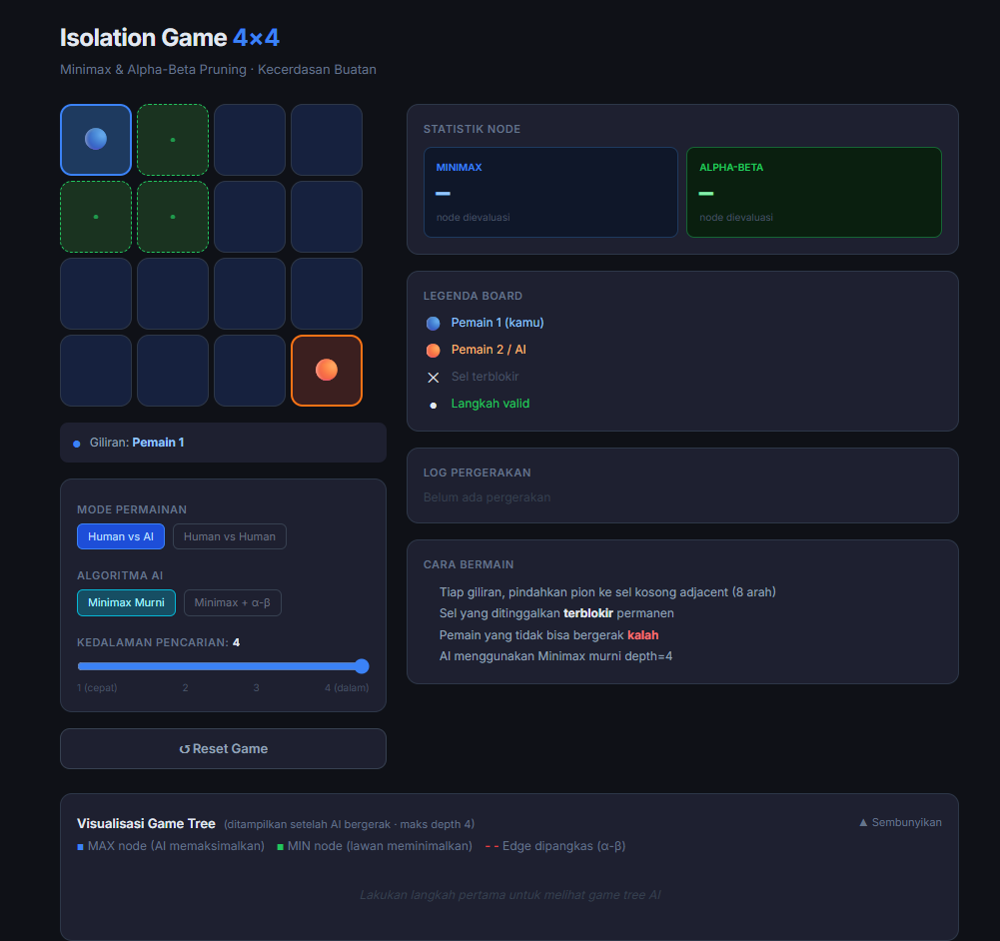
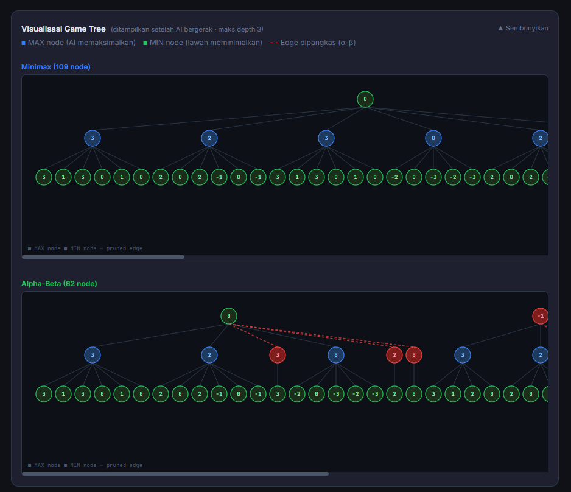
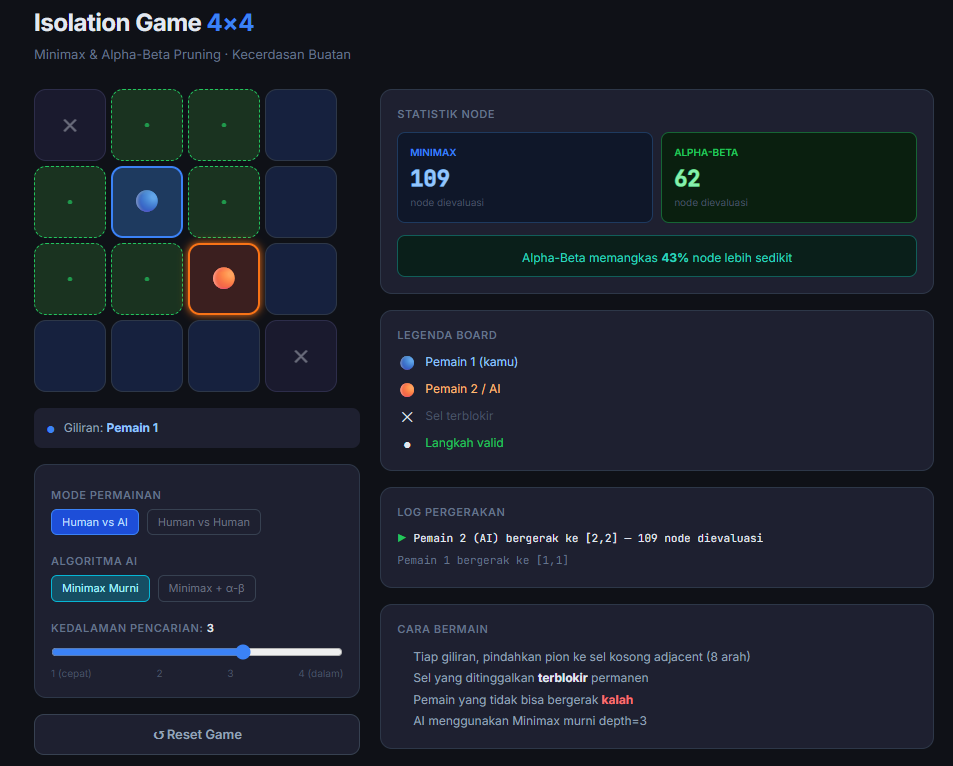

# 🎮 Isolation Game 4×4 — Adversarial Search

Simulasi permainan **Isolation** berbasis web yang mengimplementasikan algoritma **Minimax** dan **Alpha-Beta Pruning** dari nol. Dibuat sebagai project mata kuliah Kecerdasan Buatan, S1 Teknik Informatika.

[


---

## 📌 Deskripsi Project

Game Isolation adalah permainan dua pemain (*zero-sum game*) di mana setiap pemain bergerak ke sel kosong yang berdekatan (8 arah). Sel yang ditinggalkan akan **terblokir permanen**. Pemain yang tidak bisa bergerak dinyatakan **kalah**.

Project ini mengimplementasikan AI berbasis algoritma **Minimax** dengan optimasi **Alpha-Beta Pruning** untuk menentukan langkah optimal agen komputer. Tersedia juga visualisasi game tree secara real-time dan perbandingan performa node count antar algoritma.

---

## ✨ Fitur

| Fitur | Status |
|---|---|
| Mode Human vs AI (Minimax) | ✅ |
| Implementasi Alpha-Beta Pruning | ✅ |
| Toggle Minimax murni vs Minimax + Alpha-Beta | ✅ |
| Visualisasi Game Tree (real-time, min. 3 level) | ✅ |
| Counter node: Minimax vs Alpha-Beta | ✅ |
| Pengaturan kedalaman pencarian (depth 1–4) | ✅ |
| Indikator giliran & status permainan | ✅ |
| Tabel perbandingan performa otomatis | ✅ |
| Log pergerakan per langkah | ✅ |
| Mode Human vs Human (bonus) | ✅ |
| Tampilan responsif (desktop & mobile) | ✅ |

---

## 🖥️ Screenshot

### Tampilan Utama


### Visualisasi Game Tree


### Perbandingan Node Count


---

## 🚀 Cara Menjalankan

### Online (Recommended)
Akses langsung di: **[https://[domain-kamu].my.id](https://[domain-kamu].my.id)**

### Lokal
Tidak memerlukan instalasi atau build tool apapun — cukup buka file HTML langsung di browser.

```bash
# Clone repository
git clone https://github.com/[username]/adversarial-search-[nama-atau-nim].git

# Masuk ke direktori
cd adversarial-search-[nama-atau-nim]

# Buka di browser (pilih salah satu)
# Windows:
start index.html

# Mac:
open index.html

# Linux:
xdg-open index.html
```

Atau gunakan Live Server jika pakai VS Code:
1. Install ekstensi **Live Server** di VS Code
2. Klik kanan `index.html` → **Open with Live Server**
3. Browser otomatis terbuka di `http://localhost:5500`

> **Tidak perlu** Node.js, npm, atau server backend. Semua berjalan di sisi klien (Vanilla JS + React CDN + Tailwind CDN).

---

## 🧠 Cara Bermain

1. **Pilih mode permainan**: Human vs AI atau Human vs Human
2. **Pilih algoritma AI**: Minimax Murni atau Minimax + Alpha-Beta
3. **Atur kedalaman** pencarian (depth 1–4)
4. Klik **sel hijau** untuk memindahkan pion kamu
5. Sel yang ditinggalkan otomatis terblokir (tanda ✕)
6. Pemain yang **tidak bisa bergerak** kalah

---

## ⚙️ Algoritma yang Diimplementasikan

### Minimax
```
function minimax(board, depth, isMaximizing):
    if depth == 0 or terminal(board):
        return evaluate(board)
    
    if isMaximizing:
        best = -∞
        for each move in legalMoves(board):
            val = minimax(applyMove(board, move), depth-1, false)
            best = max(best, val)
        return best
    else:
        best = +∞
        for each move in legalMoves(board):
            val = minimax(applyMove(board, move), depth-1, true)
            best = min(best, val)
        return best
```

### Alpha-Beta Pruning
```
function alphabeta(board, depth, alpha, beta, isMaximizing):
    if depth == 0 or terminal(board):
        return evaluate(board)
    
    if isMaximizing:
        best = -∞
        for each move in legalMoves(board):
            val = alphabeta(applyMove(board, move), depth-1, alpha, beta, false)
            best = max(best, val)
            alpha = max(alpha, best)
            if beta <= alpha: break  ← PRUNING
        return best
    else:
        best = +∞
        for each move in legalMoves(board):
            val = alphabeta(applyMove(board, move), depth-1, alpha, beta, true)
            best = min(best, val)
            beta = min(beta, best)
            if beta <= alpha: break  ← PRUNING
        return best
```

### Fungsi Heuristik
```
h(state) = jumlah_langkah_AI - jumlah_langkah_lawan
```
Nilai terminal: `+100` (AI menang) / `-100` (AI kalah)

---

## 📊 Hasil Perbandingan Performa

Pengujian dilakukan pada kondisi awal permainan (papan kosong, posisi default):

| Depth | Minimax (node) | Alpha-Beta (node) | Dipangkas | Efisiensi |
|---|---|---|---|---|
| 1 | 3 | 3 | 0 | 0% |
| 2 | 23 | 17 | 6 | 26% |
| 3 | 109 | 62 | 47 | 43% |
| 4 | 453 | 88 | 365 | 81% |

> Isi tabel ini dengan data nyata dari aplikasi sebelum submit.

**Kesimpulan:** Alpha-Beta Pruning menghasilkan keputusan yang **identik** dengan Minimax murni namun dengan jumlah node yang jauh lebih sedikit, terutama di awal permainan ketika game tree masih lebar.

---

## 🛠️ Stack Teknologi

| Teknologi | Kegunaan |
|---|---|
| HTML5 + CSS3 | Struktur & styling dasar |
| React 18 (CDN) | UI komponen interaktif |
| Tailwind CSS (CDN) | Utility-first styling |
| Vanilla JavaScript | Implementasi algoritma Minimax & Alpha-Beta |
| Google Fonts (Inter + JetBrains Mono) | Tipografi |

> Tidak menggunakan library AI/game apapun. Seluruh algoritma diimplementasikan dari nol.

---

## 📁 Struktur File

```
adversarial-search-[nama-atau-nim]/
│
├── index.html          ← Seluruh aplikasi (single file)
├── README.md           ← Dokumentasi ini
└── screenshots/
    ├── main.png
    ├── gametree.png
    └── nodecount.png
```

---

## 📚 Referensi

- Russell, S., & Norvig, P. (2020). *Artificial Intelligence: A Modern Approach* (4th ed.). Pearson. [Bab 5]
- Silver, D., et al. (2016). Mastering the game of Go with deep neural networks and tree search. *Nature*, 529(7587), 484–489.
- Campbell, M., Hoane, A. J., & Hsu, F. H. (2002). Deep Blue. *Artificial Intelligence*, 134(1-2), 57–83.
- MDN Web Docs. (2024). JavaScript Reference. https://developer.mozilla.org
- MIT OpenCourseWare. (2023). 6.034 Artificial Intelligence. https://ocw.mit.edu

---

## 👤 Author
Asep Sunandar
- NIM: 301240039
- Kelas: 4B
- GitHub: https://github.com/nandarr21 

---

## 📄 Lisensi

Project ini dibuat untuk keperluan akademik — mata kuliah Kecerdasan Buatan
